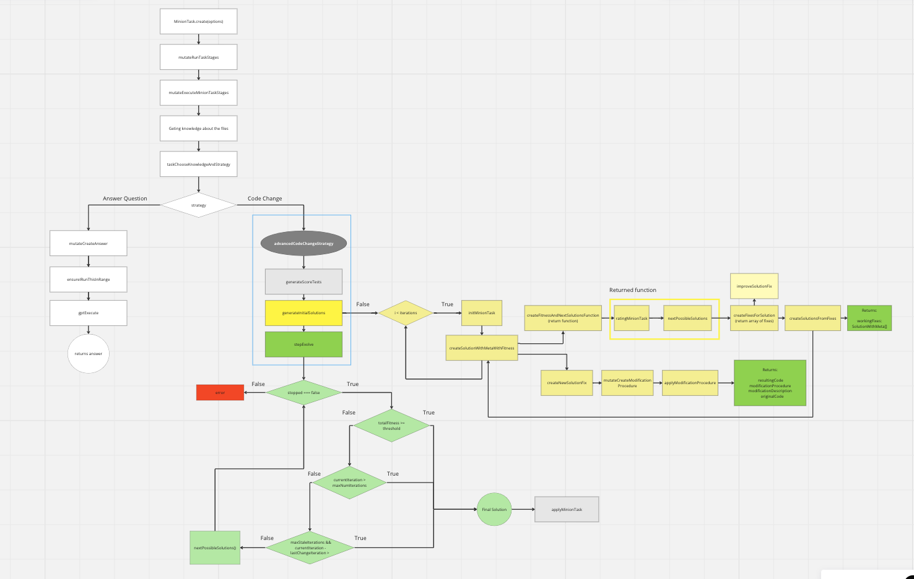

<h2 align="center"><br>10C Minions Engine</h2>


* [Introduction](#introduction) 
  * [Project Overview](#project-overview)
  * [Features](#features)

* [Getting Started](#getting-started)
  * [Prerequisites](#prerequisites)
  * [Installation](#installation) 
  * [Examples](#examples)

* [API Reference](#api-reference)

* [Contributing](#contributing)
  * [How to Contribute](#how-to-contribute)
  * [Bug report or feature request](#bug-report-or-feature-request)
  * [Testing](#testing)


* [License](#license)

<!-- * [Community and Support](#community-and-support) -->

* [Acknowledgments](#acknowledgments)


## Introduction
### **Project Overview** 
  Unleash the power of autonomous coding with 10Minions, a cutting-edge coding assistant built on the GPT-4 platform. Seamlessly integrated with Visual Studio Code, 10Minions helps you manage complex coding tasks across your codebase, delivering clean, efficient, and standardized code.

  This package is a core of 10Minions. It is responsible for communication with GPT-4/GPT3.5 and managing minions.

  10Minions  repository: 
  https://github.com/10clouds/10minions-vscode

### **Features:** 
  - Translate complex coding tasks into natural language directives.
  - Streamline your coding process across multiple files
  - Collaborate with minions for optimum solutions
  - Save time and mental bandwidth by handling multiple operations simultaneously
  - Employ minions across various programming languages
  - Enhance productivity by managing multiple tasks concurrently
  - Improve code quality and adherence to industry standards, potentially reducing bug occurrence by up to 30%

## Getting Started
### **Prerequisites:** 
  - `node >= 18.0.0`
  - `yarn`
### **Installation:** 
  ```bash
  git clone https://github.com/10clouds/10minions-engine.git
  cd 10minions-engine
  npm install or yarn install
  ```
  ```bash
  npm install 10minions-engine
  ``` 
  or 

  ```bash
   yarn add 10minions-engine
   ```

   If you want to experiment with the engine locally use:
   ```bash
   yarn link
   ```
   to link the engine to your project and then use 

   ```bash
   yarn link 10minions-engine 
   ```
   in your project to use the local version of the engine.

### **Examples** 
  all examples are located in `src/examples` folder
  also you can check 10Minions vscode extension repository: 
  https://github.com/10clouds/10minions-vscode

## API Reference

### CLI:
  `CLIEditEntry`- is a class that represents a single entry of file and helps to store information eg. startLine, endLine or startCharacter. It is used in CLIWorkspaceEdit

  `CLIEditorDocument` - is a class that implements simplified VSCode.TextDocument interface. It defines method that modifies document and contains information about it like languageId, lines etc. It is used in CLIEditorManager

  `CLIWorkspaceEdit` - here are defined methods responsible for replacing and inserting modified particular EditEntries to document.

  `CLIEditorManager` - is a class that is responsible for manage content fo the document. In here we are replacing and insert modified lines to editor document.

### gpt:
  `gptExecute` - is a function that is responsible for sending request to GPT and returning response.

  Example of usage:
  ```typescript
  const { result, cost }await gptExecute({
      fullPrompt: 'What is the best way to sort an array?',
      maxTokens: 100,
      mode: GPTMode.FAST,
      outputName: 'answer',
      outputSchema: z.string()
    })

    // result: The best way to sort an array is to use the built-in sort function.
    // cost: 0.0001
  ```

  To create more complex prompts you can use 

  ```typescript
  const promptWithSections = createFullPromptFromSections({
      intro: 'You are highly qualified software engineer and you are working on a project with your team. You are responsible for implementing a new feature.',
      sections: {
        PROBLEM: 'I have an array of objects and I want to sort them by a property of the object. Solve this problem based on the CODE section',
        CODE: 'Your code',
      }
      outro: 'Your code should be valid typescript code',
    }),
   ```       

   To ensure this prompt is runnable (it not exceed GPT model maximum tokens) by GPT you can use `ensureICanRunThis` function:

   ```typescript
    const prompt = "prompt";
    const mode = GPTMode.QUALITY;
    const tokensNeeded = countTokens(prompt, mode); 

    ensureICanRunThis({
      prompt,
      mode,
      maxTokens: tokensNeeded,
    });

    // if tokensNeeded is greater than maxTokens it will throw an error
  ```

### Managers:
 `AnalysisManager` is responsible for collecting information about execution of minion task and open ai request and it sends it to firebase.

  You can define it like this:
  ```typescript

  const analyticsManager = new AnalyticsManager(
   installationId,
   version, // in minions extension we use vscode.version
  );

  // It is important to set sendDiagnosticsData to true if you want to send diagnostics data to firebase

  analyticsManager.setSendDiagnosticsData(
    true // if you want to send diagnostics data to firebase set this to true
  );

  // to set analytics manager use:

  setAnalyticsManager(analyticsManager);

  // to get analytics manager use:

  getAnalyticsManager();

  ```
  `CommandHistoryManager` is an interface that defines methods for managing command history. It is used to store and manage commands that user executed in the editor. You can find example implementation [here](https://github.com/10clouds/10minions-vscode/blob/main/src/vscode/VSCommandHistoryManager.ts)

  `ConsumingOpenAICacheManager` is an interface that handle cache for open ai requests. It is used to store and manage open ai requests.

  `EditorManager` is an interface that defines methods for managing vscode editor and document it should be used whenever we want to communicate with the vscode and for example display notification or apply changes on users file.

  `MinionTaskManager` is an interface that defines methods for managing minion task. You can find example implementation [here](https://github.com/10clouds/10minions-vscode/blob/main/src/vscode/VSMinionTasksManager.ts)

  `ViewProvider` is an interface that defines methods for managing view provider. It is used to manage view in the editor. You can find example implementation [here](https://github.com/10clouds/10minions-vscode/blob/main/src/vscode/VSViewProvider.ts)

  ### Execution of minion task:

  ```typescript
  // defining minion task
  const task = await MinionTask.create({
    userQuery: 'Add comments to this code',
    document: await getEditorManager().openTextDocument(
      getEditorManager().createUri(path.join(__filename)),
    ),
    selection: {
      start: { line: 0, character: 0 },
      end: { line: 0, character: 0 },
    },
    selectedText: '',
    minionIndex: 0, 
    onChanged: async () => {
      console.log(`Progress: ${(task.progress * 100).toFixed(0)}%`);
    },
  });
  // executing minion task prompts and modifications
  await mutateRunTaskStages(task, mutateExecuteMinionTaskStages);
  // applying minion task modifications
  await mutatorApplyMinionTask(task);
  ```

  Workflow of execution of minion task [diagram](https://miro.com/app/board/uXjVNYipUmE=/?share_link_id=197734473483)

  

## Contributing
### **How to Contribute:** 
1. Fork the Repository: Fork the repository to your GitHub account.

2. Clone the Repository: Clone the forked repository to your local machine.

```sh
git clone https://github.com/10clouds/10minions-engine.git
```
3. Create a New Branch: Create a new branch for your contribution.

```sh
git checkout -b feature-branch-name
```
4. Make Changes: Make your changes and commit them with clear, concise commit messages.

5. Push Changes: Push your changes to your forked repository.

```sh
git push origin feature-branch-name
```
6. Create a Pull Request: Create a pull request from your branch to the main repository. Ensure the PR description clearly describes the changes you've made.

Thank you for considering contributing to our project! Your help is greatly appreciated.

### **Bug report or feature request** 
1. Check Existing Issues: Before you report a bug or feature request, please check if the issue is already reported in the [Issues](https://github.com/10clouds/10minions-engine/issues) section.
2. Choose the Report bug/feature request template and create a new issue. Try to describe the issue in detail, including how to reproduce it.

### **Coding Standards:** Coding style, conventions, and best practices.

### **Testing:** 
Firstly, you need to evaluate what kind of test you want to run.\
There are three types of tests:

- createProcedure\
   In most cases we do those tests when something with procedure is wrong,
  but modification is correct.
  This is deterministic test.
- replaceProcedure\
  In most cases we do those tests when something with result is wrong,
  but modification and procedure is correct.
  This is deterministic test.
- score
  In most cases we do those tests when something with modification is wrong,
  but procedure and result is correct.
  This is nondeterministic test.

**Before running test run script that will prepare test files for particular minionTask**


To create new test case use this script:

```bash
yarn prepareTest
```
then pass a minionTask id and name of your test and choose type of the test.


This script will generate files depends on what type of test you choose.
For `createProcedure` and `replaceProcedure` it will generate files:

- [Original file name].original.txt\
   this file contains original text from users file it is placed in originalText column in firestore
- procedure.txt\
   this file contains procedure that is generated by 10Minions it is placed in modificationProcedure column in firestore
- result.txt\
  which contains expected result of your test (content of thi file is take from finalContent column and it needs to be adjusted to your test)

for `createProcedure` it will also generate file:

- modification.txt\
   which contains modification description - it describes steb by step what kind of modification was done to original text
  it came from modificationDescription column in firestore

For `score` it will generate files:\

- original.txt
- userQuery.txt
- tests.json
- selectedText.txt - optional\
  in this file you can define your tests

  when you choose score test type tests.json file will be filled with the test cases generated by GPT and you can modify them to your needs.

  Script that do it is located in `src/score/generateScoreTests.ts`

Example test case:

  ```json
  [{ "type": "gptAssert", "mode": "FAST", "assertion": "The code is valid typescript code" }]
  ```

  mode can be set to `FAST` or `QUALITY`

  `QUALITY` is for GPT-4

  `FAST` is for GPT-3.5

  in assertion you can define expectations what should be returned from GPT\
  eg. 'Import has been defined at the beginig of the file'

To run `createProcedure` and `replaceProcedure` test you need to run command:

```bash
yarn test
```

if you want to run just one test at time just set `grep` in your config to your test name.

The config is located in `src/test/runTest.ts`

```typescript
const mocha = new Mocha({
  grep: "Your test name",
});
```

To run `score` test you need to run command:

```bash
yarn score
```


The score tests always return score measured in percents.\

Score test are rated in `src/score/rateMinionTask.ts` file.
In simple words it checks if the returned result fullfill the criteria from test.json file and gives a rate from 0-20. Script is based on gpt request that just returns the score. 

Calculating score:

```typescript
const score = (iterations - failedTestsNumber) / iterations;
```

where `failed` is number of not passed tests.

The score tests are non-determinstic,

**Non-determinism basically stands for flickering tests. These are tests that pass most of the time but fail once in a while and then if you try to run them one more time - turn green again.**


## License

Copyright ©  2023 10Clouds

Permission is hereby granted, free of charge, to any person obtaining a copy
of this software and associated documentation files (the "Software"), to deal
in the Software without restriction, including without limitation the rights
to use, copy, modify, merge, publish, distribute, sublicense, and/or sell
copies of the Software, and to permit persons to whom the Software is
furnished to do so, subject to the following conditions:

The above copyright notice and this permission notice shall be included in all
copies or substantial portions of the Software.

THE SOFTWARE IS PROVIDED "AS IS", WITHOUT WARRANTY OF ANY KIND, EXPRESS OR
IMPLIED, INCLUDING BUT NOT LIMITED TO THE WARRANTIES OF MERCHANTABILITY,
FITNESS FOR A PARTICULAR PURPOSE AND NONINFRINGEMENT. IN NO EVENT SHALL THE
AUTHORS OR COPYRIGHT HOLDERS BE LIABLE FOR ANY CLAIM, DAMAGES OR OTHER
LIABILITY, WHETHER IN AN ACTION OF CONTRACT, TORT OR OTHERWISE, ARISING FROM,
OUT OF OR IN CONNECTION WITH THE SOFTWARE OR THE USE OR OTHER DEALINGS IN THE
SOFTWARE.

<!-- ## Community and Support
- Links to community forums, mailing lists, or social media channels.
- Information about official support channels. -->

## Acknowledgments
A big thank you to all contributors! Your passion and contributions have made this project amazing. Your support is invaluable, and we're grateful for your dedication to open source. Together, we're creating something extraordinary.

With heartfelt thanks,

10Clouds Team


